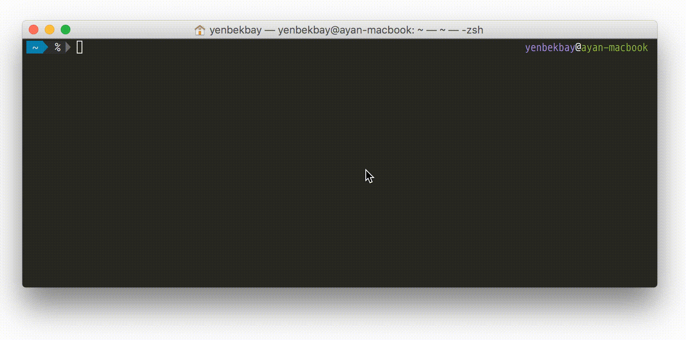

# app-stats
**Get statistics for your iOS app (downloads, average app store rating, Mixpanel analytics)**

[![NPM version][npm-image]][npm-url] [![Downloads][downloads-image]][npm-url] [![Build Status][travis-image]][travis-url]

[![NodeICO][nodeico-image]][nodeico-url]



## Installation

``` bash
  $ [sudo] npm install app-stats -g
```

## Usage

Just run `app-stats` and complete the configuration. After that you can set up Mixpanel accounts for new apps by running `app-stats setup`.

## The MIT License

Copyright (C) 2015  Ayan Yenbekbay

Permission is hereby granted, free of charge, to any person obtaining a copy
of this software and associated documentation files (the "Software"), to deal
in the Software without restriction, including without limitation the rights
to use, copy, modify, merge, publish, distribute, sublicense, and/or sell
copies of the Software, and to permit persons to whom the Software is
furnished to do so, subject to the following conditions:

The above copyright notice and this permission notice shall be included in
all copies or substantial portions of the Software.

THE SOFTWARE IS PROVIDED "AS IS", WITHOUT WARRANTY OF ANY KIND, EXPRESS OR
IMPLIED, INCLUDING BUT NOT LIMITED TO THE WARRANTIES OF MERCHANTABILITY,
FITNESS FOR A PARTICULAR PURPOSE AND NONINFRINGEMENT. IN NO EVENT SHALL THE
AUTHORS OR COPYRIGHT HOLDERS BE LIABLE FOR ANY CLAIM, DAMAGES OR OTHER
LIABILITY, WHETHER IN AN ACTION OF CONTRACT, TORT OR OTHERWISE, ARISING FROM,
OUT OF OR IN CONNECTION WITH THE SOFTWARE OR THE USE OR OTHER DEALINGS IN
THE SOFTWARE.

[downloads-image]: https://img.shields.io/npm/dm/app-stats.svg
[npm-url]: https://www.npmjs.com/package/app-stats
[npm-image]: https://img.shields.io/npm/v/app-stats.svg

[travis-url]: https://travis-ci.org/yenbekbay/app-stats
[travis-image]: https://img.shields.io/travis/yenbekbay/app-stats.svg

[nodeico-url]: https://nodei.co/npm/app-stats
[nodeico-image]: https://nodei.co/npm/app-stats.png?downloads=true&downloadRank=true
